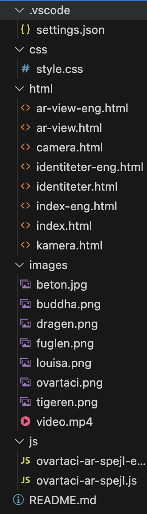
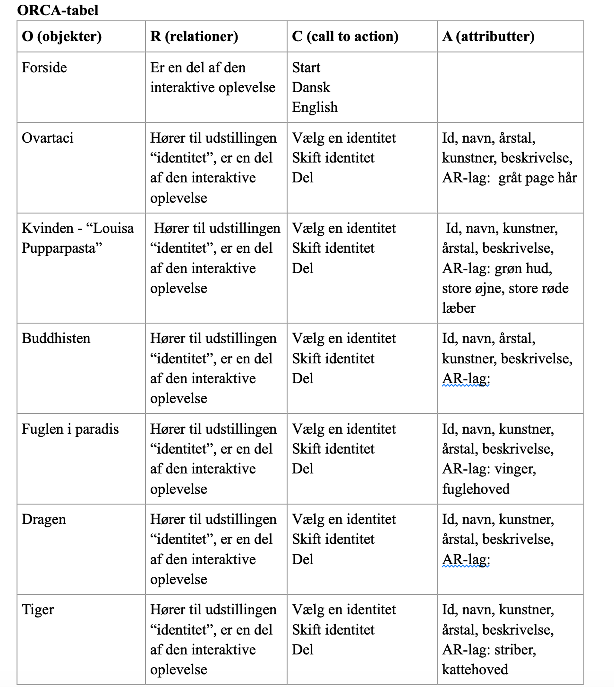
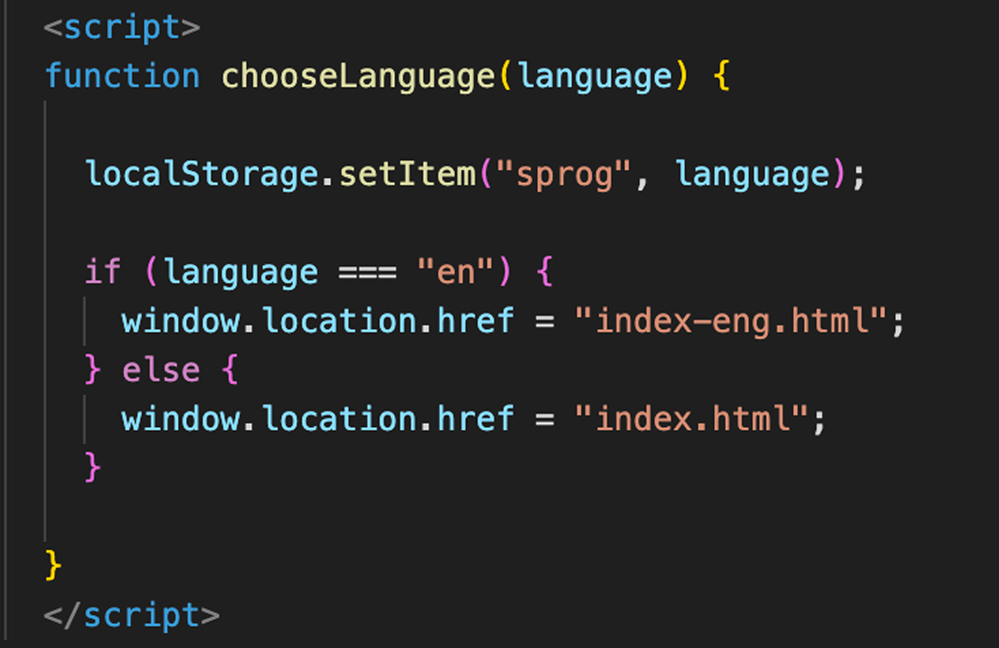
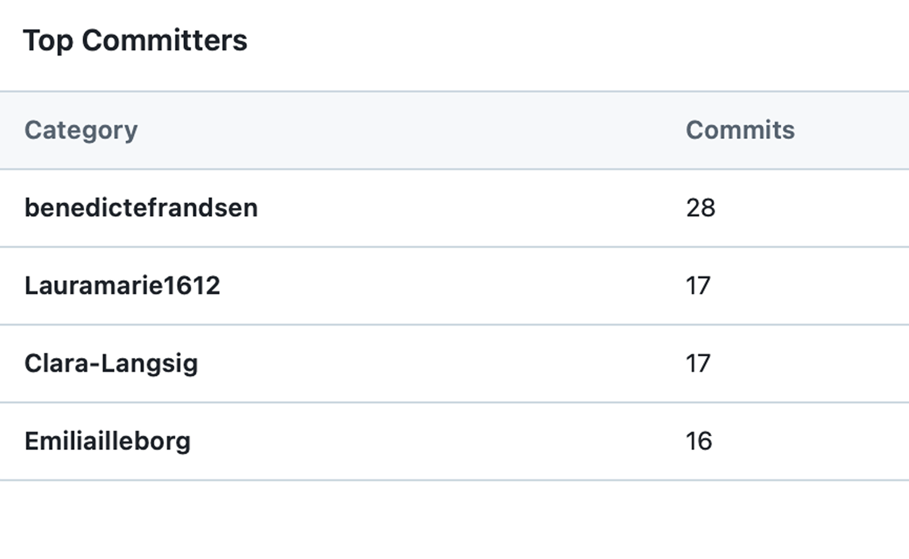
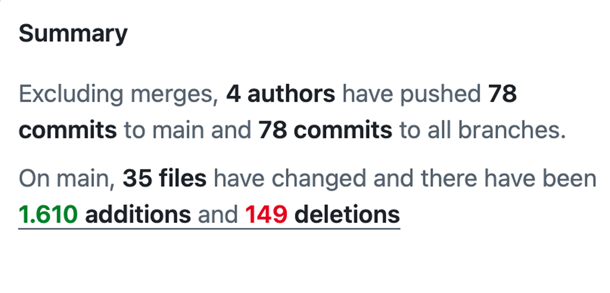
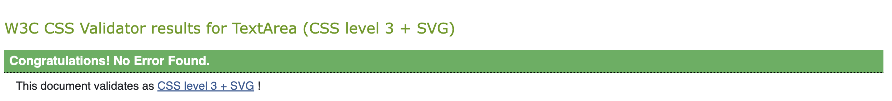
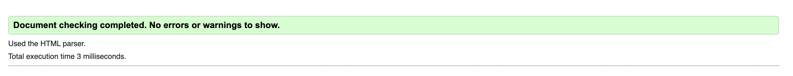

# eksamen-exd

# Ovartaci AR Mirror

**Multimediedesign**
**Udvikler:** Benedicte, clara, Emilia og Laura (2026)

Dette projekt er udviklet som en digital prototype inspireret af Ovartacis identiteter og kunstneriske univers. Formålet med løsningen er at skabe en interaktiv AR-/LED-spejloplevelse, hvor brugeren kan udforske forskellige identiteter gennem et visuelt og immersivt interface.

Projektet er udviklet i HTML, CSS og JavaScript.

# Projekt struktur



- HTML-mappen indeholder projektets sider.
- CSS-mappen indeholder styling og animationer.
- JavaScript-mappen indeholder dynamisk funktionalitet.
- Images-mappen indeholder billeder og videoelementer.

## Navngivningskonventioner

Projektet anvender konsistente filnavne for at skabe struktur og overskuelighed.

Danske og engelske versioner af siderne adskilles gennem "-eng".

Eksempel på dansk og engelsk side:

- dragen.html
- dragen-eng.html

## Navngivning af variabler og funktioner

Der er anvendt korte variabelnavne for at gøre koden mere læsbar og overskuelig.

Eksempler:

- identiteter → array med alle identitetsobjekter
- identitet → repræsenterer ét objekt ad gangen
- grid → HTML-container til identitetskort
- card → dynamisk oprettet identitetskort
- Sprog

CSS-klasser er navngivet på engelsk for at skabe en ensartet struktur mellem HTML, CSS og JavaScript.

Eksempler:

- mirror-frame
- mirror-led
- start-btn
- language-selector

## Centrale valg i udviklingen

Et centralt valg i udviklingen var at skabe en futuristisk og interaktiv brugeroplevelse inspireret af et LED-/AR-spejl.

Derfor blev følgende designvalg truffet:

# neon/LED glow-effekter

For at skabe den visuelle stemning af et LED-spejl, har vi stylet det i CSS med koden:

```css
.mirror-frame
width: 600px;
height: 750px;
margin: 20px auto;

box-shadow:
0 0 100px #ffffff,
0 0 150px rgba(255, 255, 255, 0.8),
0 0 250px rgba(255, 255, 255, 0.6);
```

# video-baggrund

Vi har tilføjet en video som baggrund, da den skaber opmærksomhed, det har vi gjort ved at linke til den i index.html og index-eng.html. Sat en loop på, så den køre automatik hele tiden

```html
<div class="mirror-frame">
  <video class="bg-video" autoplay muted loop playsinline controls>
    <source src="../images/video.mp4" type="video/mp4" />
  </video>
</div>
```

# glassmorphism-effekter

```CSS
/_ Animeret glimtende lysstreg _/
.mirror-led::after {
content: "";
position: absolute;
inset: 0;
border-radius: 28px;
z-index: 2;
pointer-events: none;
overflow: hidden;

background: linear-gradient(
120deg,
transparent 30%,
rgba(255, 255, 255, 0.12) 48%,
rgba(255, 255, 255, 0.22) 50%,
rgba(255, 255, 255, 0.12) 52%,
transparent 70%
);
background-size: 200% 100%;
animation: spejl-glim 6s ease-in-out infinite;
}

@keyframes spejl-glim {
0% {
background-position: -100% 0;
opacity: 0;
}
10% {
opacity: 1;
}
40% {
background-position: 200% 0;
opacity: 1;
}
50% {
opacity: 0;
}
100% {
opacity: 0;
background-position: 200% 0;
}
}
```

# store klikbare elementer

Eksempel:

```css
.ja-btn {
  padding: 10px 20px;
  border-radius: 30px;
  margin-bottom: 20px;
}
```

# minimalistisk navigation

Den skal være nemt for brugeren at bevæge sig rundt på skærmen, derfor er der ikke mange valg til brugeren

## ORCA-tabel og datastruktur

Projektets indhold er organiseret ud fra en ORCA-struktur, hvor identiteterne er opbygget som objekter i et JavaScript-array.



Eksempel på datastruktur:

```JS
const identiteter = [
{
id: 1,
Navn: "Louisa Pupparpasta",
Beskrivelse: "...",
Billede: "/images/louisa.png",
Link: "ar-view.html?id=1"
}
]
```

Denne struktur gør det muligt dynamisk at generere indhold på siden samt hente information ud fra brugerens valg.

## Mapping mellem ORCA-tabellen og JavaScript-datastruktur

ORCA-tabellen blev anvendt som grundlag for opbygningen af projektets JavaScript-datastruktur. Hvert objekt i ORCA-tabellen repræsenteres som et objekt i arrayet identiteter, hvor attributterne fra analysen er mappet til egenskaber i JavaScript.

Attributterne id, navn, kunstner, årstal og beskrivelse blevet omsat til felterne id, Navn, Kunster, Årstal og Beskrivelse i datastrukturen. Derudover er felterne Billede og Link tilføjet for at understøtte den digitale oplevelse og navigation mellem siderne.

Call-to-actions som Vælg en identitet er implementeret gennem klikbare identitetskort, det videresender brugeren til den relevante AR-side, hvor de kan prøve den valgte identitet

## Anvendelse af localStorage

I projektet har vi anvendt Local Storage til at gemme brugerens valg direkte i browseren.

Gemme valgt sprog:

Når brugeren vælger mellem dansk og engelsk på forsiden, gemmes sproget i Local Storage ved hjælp af:
localStorage.setItem("sprog", language);
På den måde husker browseren, hvilket sprog brugeren har valgt.

Hente gemt sprog:

På de efterfølgende sider hentes det gemte sprog igen med:
const sprog = localStorage.getItem("sprog");
Dette gør det muligt at se, hvilket sprog der tidligere er blevet valgt.



## Anvendte JavaScript-teknologier

Følgende JavaScript-teknologier er anvendt i projektet:

- Arrays
- Objekter
- forEach-loops
- DOM manipulation
- Event listeners
- localStorage
- Template literals
- Dynamisk HTML-generering

Disse teknologier bruges til at skabe interaktivitet og dynamisk indhold.

## GitHubs samarbejde

Projektet blev udviklet i et fælles GitHub-repository, hvor alle gruppemedlemmer havde adgang til kodebasen. Vi arbejdede løbende med at opdatere projektet gennem commits, som blev anvendt til at dokumentere ændringer og fremskridt i udviklingen.

For at sikre, at alle arbejdede på den nyeste version af projektet, anvendte vi GitHubs push- og pull-funktioner. Inden nye ændringer blev uploadet, blev den seneste version af repositoryet hentet via pull, hvorefter ændringerne blev pushet til GitHub.

Vi arbejdede med meningsfulde og beskrivende commit-beskeder, som kort beskrev de ændringer, der var foretaget

Projektet blev udviklet direkte i det fælles repository uden brug af separate branches eller pull requests. Samarbejdet blev i stedet koordineret gennem løbende kommunikation i gruppen da vi sad sammen fysisk, og ved regelmæssigt at synkronisere ændringer via GitHub.




## Konklusion

Projektet kombinerer HTML, CSS og JavaScript i en interaktiv prototype med fokus på brugeroplevelse, identitet og digital formidling. Der er arbejdet med både æstetik, funktionalitet og dynamisk indhold for at skabe en immersiv oplevelse inspireret af Ovartacis univers.




```

```
